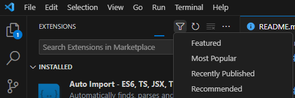
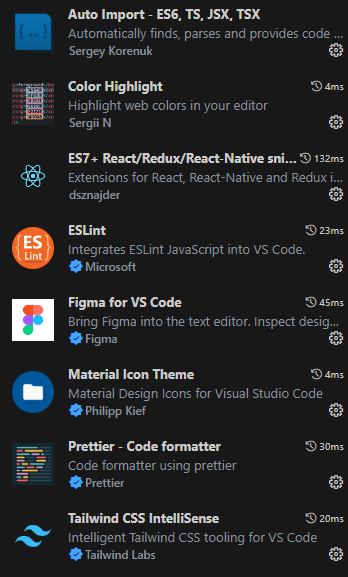

# Keep 함 빌드

## 초기 설치시 환경설정

### pnpm 설치

- 본 프로젝트에서는 패키지 매니저로 `pnpm`을 사용합니다
  - npm, yarn, pnpm 등이 있음

```shell
npm i -g pnpm
```

- 프로젝트 진행중 패키지 설치가 필요할 경우 **반드시** `pnpm i`를 통해서 설치합니다

### VS code 실행

- `webpage` 폴더을 열어서 작업한다

### 추천 확장프로그램 설치

- 필터에서 Recommended 선택



- Color Highlight, Figma 제외 전부 설치 권장
  - 개발 편의성을 향상시키고 오류를 잡아준다



## git clone / git switch 이후

### 종속성 모듈 다운로드

```shell
pnpm i
```

## 개발 명령어

> 명령어들은 `package.json`에서 `scripts` 항목을 보면 확인 가능하다

### 개발 중 화면

```sh
pnpm dev
```

### 개발 후 빌드

- 배포시 사용

```sh
pnpm build
```

### 빌드된 화면

```sh
pnpm preview
```

## 리액트

### path alias (경로 축약)

- /src 폴더는 `@` 경로로 단축해서 접근가능

### 코드컨벤션

1. 컴포넌트 '\*.tsx'파일은 CamelCase로 작성
2. /public 폴더에 저장한 이미지는 자동으로 root (`/`) 디렉토리에 저장된다
   - `[파일명]`으로 바로 import 가능
3. `App.tsx`, `index.html` 파일은 수정하지 않는다
4. 페이지 컴포넌트는 `/src/Pages`에 저장
5. 페이지 내부 컴포넌트는 `/src/Components/[페이지명]`에 저장
6. 하기의 태그는 대체하여 사용한다

```jsx
// Mui
<button /> => <Button />
<form /> => <Form />
단순텍스트 => <Typography />

// React Router
<a /> => <Link />
```
