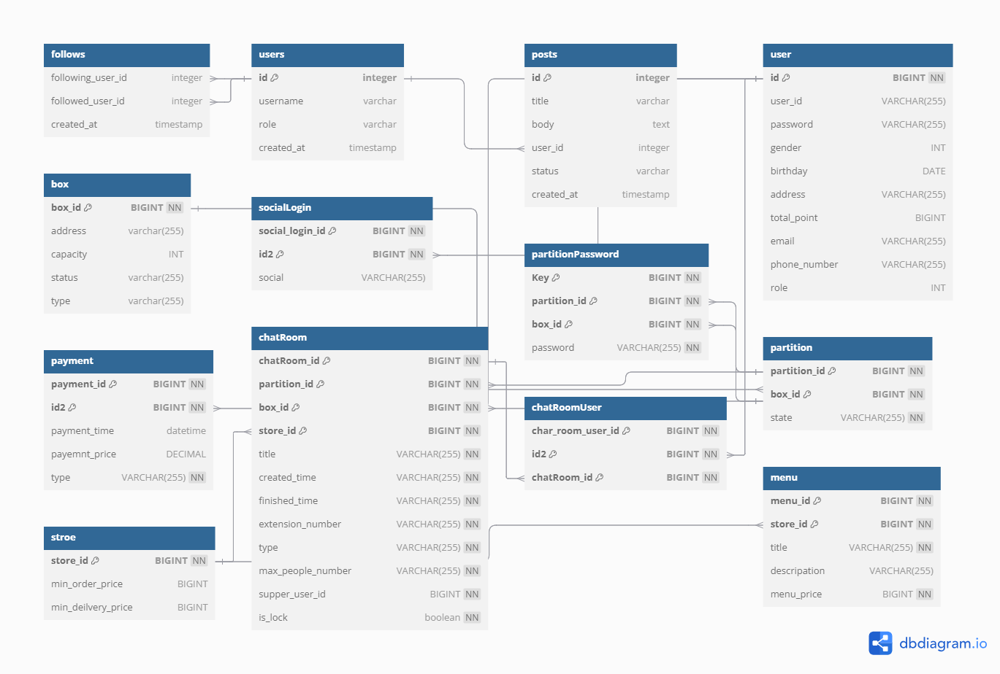
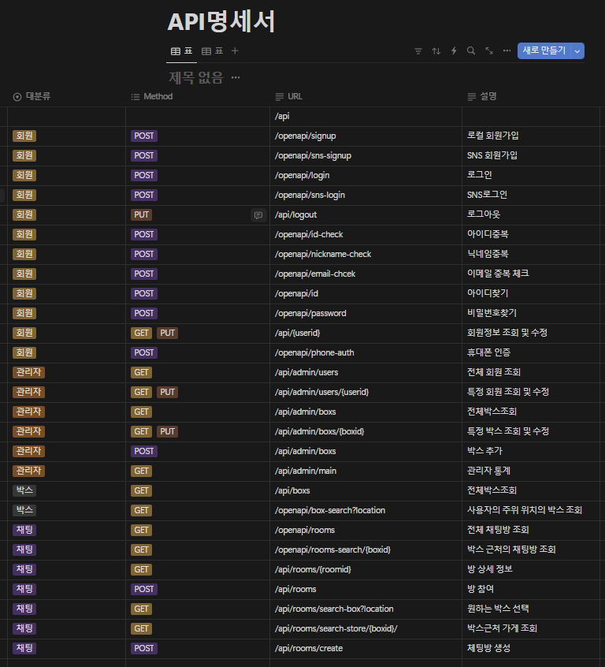
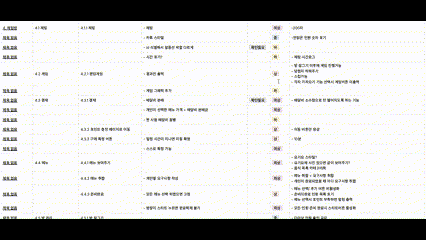

# 가게를 기준으로 고객들을 매칭하여 안전결제를 통해 같이 배달 시킬 수 있게 도와주는 보관함 서비스

# 📌기능 소개

### 1. 보관함 관리
   - 비밀번호, QR코드, 웹으로 함을 여는 기능
   - UV랜턴을 이용하여 보관함을 소독
   - 서버에 등록하고 관리하는 기능
   - 보관함의 지정 비밀번호 생성 기능

### 2. 채팅방  기능
   - 채팅 기능
   - 채팅방 관리 기능
   - 보관함과 가게에 대한 채팅방 생성 기능
   - 가게의 메뉴 정보 제공
   - 고객들의 메뉴 취합 기능

### 3. 포인트 기능
   - 포인트 충전 기능
   - 메뉴를 결제하는 기능
   - 채팅방의 모든 인원이 음식을 받고 동의를 누르면 방장에게 포인트 송금 기능

### 4. 회원 관리
- 고객 정보 관리
- 포인트 내역 확인 기능

# 📌프로젝트 진행 및 산출물

### 프로젝트 개발 기간

2023.07.04 ~ 2023.08.18

### 프로젝트 산출물

### 1. ERD

### 2. API 설계서

### 3. 요구사항 정의서

